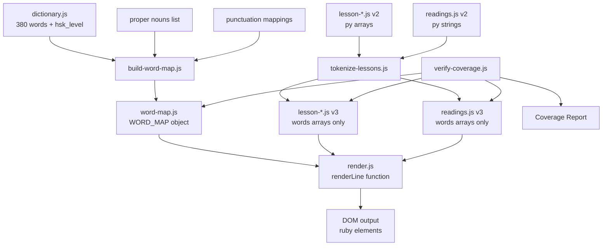

# Design Document: HSK App v3 Migration

## Overview

This document provides the technical design for migrating the HSK 1 Learning App from the v2 architecture to v3. The migration centralizes pinyin pronunciation data through a single `WORD_MAP` object, eliminating duplicate pinyin arrays scattered across lesson and reading files. This architectural shift reduces data redundancy, simplifies content authoring, and creates a single source of truth for pronunciation corrections.

### Problem Statement

In the current v2 architecture, every reading line carries both a `words[]` array (Chinese tokens) and a parallel `py[]` array (pinyin for each token). This creates three critical problems:

1. **Data Duplication**: The same word's pinyin must be manually entered on every line it appears across all 12 lessons and 24 readings
2. **Maintenance Burden**: Fixing a pinyin typo requires finding and updating dozens of occurrences
3. **Error Proneness**: Array length mismatches between `words[]` and `py[]` cause silent rendering failures with misaligned or missing pinyin
4. **Content Authoring Friction**: Adding new reading material requires manually entering pinyin for every word, even if those words already exist elsewhere

### Solution Approach

The v3 architecture introduces a central `WORD_MAP` — a flat JavaScript object mapping Chinese characters/words to their pinyin pronunciation. Reading lines store only the `words[]` array. The renderer performs runtime lookup in `WORD_MAP` to resolve pinyin on-demand.

**Benefits**:
- Fix pronunciation errors once, automatically applying to all content
- Smaller reading files (no duplicate pinyin arrays)
- No array mismatch risk (single source of truth)
- New content inherits pinyin automatically
- Consistent pronunciation across entire application

### Design Goals

1. **Single Source of Truth**: All pinyin defined once in `WORD_MAP`
2. **Backward Compatibility**: Preserve existing lesson metadata, vocabulary lists, grammar sections
3. **Graceful Degradation**: Missing words render without pinyin and log warnings rather than breaking
4. **Build-Time Verification**: Scripts validate complete word coverage before deployment
5. **HSK Level Metadata**: Tag dictionary words with HSK proficiency levels for future filtering
6. **Minimal Runtime Changes**: Audio service, vocabulary modal, and TTS functionality unchanged

## Architecture

### High-Level Data Flow

```
┌─────────────────┐
│ dictionary.js   │
│ (380 words)     │──┐
│ + hsk_level     │  │
└─────────────────┘  │
                     ├──> build-word-map.js ──> word-map.js (WORD_MAP)
┌─────────────────┐  │                                  │
│ Proper nouns    │  │                                  │
│ Punctuation     │──┘                                  │
└─────────────────┘                                     │
                                                        ▼
┌─────────────────┐         ┌──────────────────────────────────┐
│ lesson-*.js     │────────>│    tokenize-lessons.js           │
│ (v2: py arrays) │         │    - Remove py arrays            │
│                 │         │    - Generate words[] arrays     │
└─────────────────┘         │    - Backup originals            │
                            └──────────────────────────────────┘
                                         │
                                         ▼
                            ┌──────────────────────────────────┐
                            │    lesson-*.js (v3)              │
                            │    - zh: string                  │
                            │    - words: string[]             │
                            │    - en: string                  │
                            │    (no py field)                 │
                            └──────────────────────────────────┘
                                         │
                                         ▼
                            ┌──────────────────────────────────┐
                            │    renderLine(line)              │
                            │    - for each word in words[]    │
                            │    - pinyin = WORD_MAP[word]     │
                            │    - create <ruby> element       │
                            └──────────────────────────────────┘
                                         │
                                         ▼
                            ┌──────────────────────────────────┐
                            │    DOM Output                    │
                            │    <ruby>你<rt>nǐ</rt></ruby>   │
                            │    <ruby>好<rt>hǎo</rt></ruby>  │
                            └──────────────────────────────────┘
```

### Component Architecture



## Components and Interfaces

### 1. WORD_MAP (word-map.js)

**Purpose**: Central pinyin lookup table providing a single source of truth for all word pronunciations.

**Interface**:
```javascript
// Export: window.WORD_MAP
const WORD_MAP = {
  // Single-character words
  "你": "nǐ",
  "好": "hǎo",
  
  // Multi-character words (take precedence in tokenization)
  "你好": "nǐ hǎo",
  "名字": "míngzi",
  
  // Proper nouns (capital first letter)
  "李华": "Lǐ Huá",
  "北京": "Běijīng",
  
  // Punctuation (empty string = no ruby wrapper)
  "。": "",
  "，": "",
  "！": "",
  "？": ""
};
```

**Data Structure**: Flat object with string keys and string values

**Key Characteristics**:
- Keys: Chinese characters/words (single or multi-character)
- Values: Pinyin with tone marks (e.g., "nǐ hǎo", not "ni3 hao3")
- Proper nouns use capital first letter in pinyin
- Punctuation maps to empty string `""`
- Estimated size: ~380 words from dictionary + ~20 proper nouns + ~10 punctuation marks = ~410 entries

### 2. Dictionary (data/dictionary.js)

**Current Structure**:
```javascript
window.HSK_DICTIONARY = {
  "words": [
    {
      "c": "你",      // Chinese character
      "p": "nǐ",      // Pinyin
      "e": "you",     // English
      "cat": "pronoun" // Category
    }
  ]
}
```

**Enhanced Structure (v3)**:
```javascript
window.HSK_DICTIONARY = {
  "words": [
    {
      "c": "你",
      "p": "nǐ",
      "e": "you",
      "cat": "pronoun",
      "hsk_level": 1    // NEW: HSK proficiency level
    }
  ]
}
```

**Migration Requirements**:
- Add `hsk_level` field to all 380 existing word entries
- HSK1 core vocabulary (~150 words) tagged with `hsk_level: 1`
- Remaining words tagged with appropriate levels (2, 3, etc.)
- Maintain backward compatibility (all existing fields unchanged)

### 3. Lesson Files (data/lessons/lesson-*.js)

**Current v2 Structure**:
```javascript
"sentences": [
  {
    "zh": "你好！",
    "py": "Nǐ hǎo!",        // REMOVED in v3
    "en": "Hello!"
  }
]
```

**Target v3 Structure**:
```javascript
"sentences": [
  {
    "zh": "你好！",
    "words": ["你好", "！"],  // NEW: tokenized array
    "en": "Hello!"
  }
]
```

**Tokenization Strategy**: Greedy longest-match algorithm
- Attempt to match longest multi-character words first (e.g., "你好" as one token, not ["你", "好"])
- Fall back to single characters if no multi-character match found
- Preserve punctuation as separate tokens
- Example: "你好！你叫什么名字？" → ["你好", "！", "你", "叫", "什么", "名字", "？"]

### 4. Readings File (data/readings.js)

**Current v2 Structure**:
```javascript
"lines": [
  {
    "zh": "他是老师。",
    "py": "Tā shì lǎoshī.",  // REMOVED in v3
    "en": "He is a teacher."
  }
]
```

**Target v3 Structure**:
```javascript
"lines": [
  {
    "zh": "他是老师。",
    "words": ["他", "是", "老师", "。"],  // NEW: tokenized array
    "en": "He is a teacher."
  }
]
```

**Migration Impact**: 24 reading stories across 12 lessons, approximately 200-300 lines total

### 5. Renderer (js/render.js)

**Core Function**: `renderLine(line)`

**Input**:
```javascript
{
  "zh": "你好！",
  "words": ["你好", "！"],
  "en": "Hello!"
}
```

**Algorithm**:
```
1. For each word in line.words:
   a. Look up pinyin = WORD_MAP[word]
   b. If pinyin === undefined:
      - Log warning: `[renderer] "word" not found in WORD_MAP`
      - Render word as plain text
   c. If pinyin === "" (punctuation):
      - Render word as plain text (no ruby wrapper)
   d. If pinyin is non-empty string:
      - Create <ruby> element
      - Append word as text node
      - Create <rt> element with pinyin
      - Append <rt> to <ruby>
2. Return document fragment with all elements
```

**Output**:
```html
<ruby>你好<rt>nǐ hǎo</rt></ruby>！
```

**Security**: Uses DOM APIs (`createElement`, `createTextNode`, `createDocumentFragment`) instead of `innerHTML` to prevent XSS

## Data Models

### WORD_MAP Entry

| Field | Type | Required | Description | Example |
|-------|------|----------|-------------|---------|
| key | string | Yes | Chinese character(s) | "你", "你好", "李华" |
| value | string | Yes | Pinyin with tone marks, or empty string for punctuation | "nǐ", "nǐ hǎo", "Lǐ Huá", "" |

**Constraints**:
- Keys must be unique
- Proper noun pinyin uses capital first letter
- Punctuation keys map to empty string value
- Multi-character words take precedence in tokenization

### Dictionary Word Entry (Enhanced)

| Field | Type | Required | Description | Example |
|-------|------|----------|-------------|---------|
| c | string | Yes | Chinese character(s) | "你好" |
| p | string | Yes | Pinyin with tone marks | "nǐ hǎo" |
| e | string | Yes | English translation | "hello" |
| cat | string | Yes | Category identifier | "greeting" |
| hsk_level | number | Yes (NEW) | HSK proficiency level (1-6) | 1 |

### Reading Line (v3)

| Field | Type | Required | Description | Example |
|-------|------|----------|-------------|---------|
| zh | string | Yes | Full Chinese text | "你好！" |
| words | string[] | Yes (NEW) | Tokenized word array | ["你好", "！"] |
| en | string | Yes | English translation | "Hello!" |

**Constraints**:
- `words[]` must reconstruct to `zh` when concatenated
- Every token in `words[]` should exist in WORD_MAP (warning if missing)
- `py` field removed from v2 schema

### Lesson Sentence (v3)

| Field | Type | Required | Description | Example |
|-------|------|----------|-------------|---------|
| zh | string | Yes | Full Chinese text | "我是学生。" |
| words | string[] | Yes (NEW) | Tokenized word array | ["我", "是", "学生", "。"] |
| en | string | Yes | English translation | "I am a student." |

### Dialogue Line (v3)

| Field | Type | Required | Description | Example |
|-------|------|----------|-------------|---------|
| speaker | string | Yes | Speaker label | "A", "B" |
| zh | string | Yes | Full Chinese text | "你好！" |
| words | string[] | Yes (NEW) | Tokenized word array | ["你好", "！"] |
| en | string | Yes | English translation | "Hello!" |

## Error Handling

### Missing Word in WORD_MAP

**Scenario**: Renderer encounters a word not defined in WORD_MAP

**Behavior**:
1. Render the Chinese character as plain text (no ruby wrapper)
2. Log console warning: `[renderer] "新词" not found in WORD_MAP`
3. Continue rendering remaining words in the line
4. Do not throw error or halt execution

**Rationale**: Graceful degradation allows app to remain functional during content development. Warnings facilitate identification of missing words.

### Array Length Mismatch (Eliminated in v3)

**Previous v2 Issue**: `words[]` and `py[]` arrays with different lengths caused misaligned pinyin

**v3 Solution**: Eliminated entirely by removing `py[]` arrays. Runtime lookup in WORD_MAP cannot produce array mismatch.

### Corrupted localStorage

**Scenario**: Settings data in localStorage is malformed JSON

**Behavior** (already implemented):
```javascript
try {
  const stored = localStorage.getItem(STORAGE_KEY);
  return stored ? JSON.parse(stored) : DEFAULT_SETTINGS;
} catch (e) {
  console.warn('[settings] Corrupted data, reverting to defaults:', e);
  return DEFAULT_SETTINGS;
}
```

### Invalid HSK Level

**Scenario**: Dictionary word has missing or invalid `hsk_level` field

**Build-Time Validation**:
- `add-hsk-levels.js` script validates all entries have `hsk_level` between 1-6
- Script fails with error report if validation fails
- Manual correction required before proceeding

### Tokenization Failure

**Scenario**: Tokenization algorithm cannot process a Chinese text string

**Behavior**:
- Fall back to character-by-character splitting
- Log warning: `[tokenizer] Failed to parse: "text", using character split`
- Continue with individual character tokens

## Testing Strategy

### Unit Tests

**Target**: Core rendering logic, tokenization algorithm, WORD_MAP lookup

**Framework**: Jest (or Mocha/Chai if already in project)

**Test Cases**:

1. **renderLine** function:
   - ✓ Renders word with pinyin from WORD_MAP as `<ruby>` element
   - ✓ Renders punctuation without `<ruby>` wrapper
   - ✓ Renders missing word as plain text and logs warning
   - ✓ Handles multi-character words correctly
   - ✓ Handles proper nouns with capitalized pinyin
   - ✓ Returns DocumentFragment (not HTML string)

2. **Tokenization**:
   - ✓ Splits text into correct word boundaries using WORD_MAP
   - ✓ Prioritizes longer multi-character words over single characters
   - ✓ Preserves punctuation as separate tokens
   - ✓ Handles edge cases (empty string, whitespace, mixed content)

3. **WORD_MAP Integrity**:
   - ✓ All values are strings (no undefined, null, or object values)
   - ✓ Punctuation entries map to empty string
   - ✓ No duplicate keys
   - ✓ Proper noun pinyin uses capital first letter

### Integration Tests

**Target**: End-to-end rendering of lesson and reading content

**Framework**: Playwright (already in project based on file structure)

**Test Cases**:

1. **Lesson Rendering**:
   - ✓ Load lesson-1.js and render sentences section
   - ✓ Verify all Chinese text has corresponding pinyin
   - ✓ Verify punctuation renders without `<rt>` tags
   - ✓ Verify proper nouns render with capitalized pinyin
   - ✓ Verify no console warnings for missing words

2. **Reading Rendering**:
   - ✓ Load readings.js and render reading #1
   - ✓ Verify all lines render correctly
   - ✓ Verify English translations display
   - ✓ Verify click-to-speak functionality works
   - ✓ Verify no console warnings for missing words

3. **Settings Integration**:
   - ✓ Toggle pinyin visibility updates CSS variable
   - ✓ Character size slider updates CSS variable
   - ✓ Settings persist after page reload
   - ✓ Dark mode toggle updates body class

4. **TTS Integration**:
   - ✓ Audio service receives full Chinese text (not individual words)
   - ✓ TTS rate and volume settings apply to utterance
   - ✓ Chinese voices load correctly

### Migration Verification Tests

**Target**: Validate successful data migration from v2 to v3

**Framework**: Node.js scripts with assertions

**Test Cases**:

1. **verify-coverage.js**:
   - ✓ Extract all unique tokens from all 12 lesson files
   - ✓ Extract all unique tokens from readings.js
   - ✓ Compare against WORD_MAP keys
   - ✓ Report any tokens not found in WORD_MAP
   - ✓ Identify multi-character words that need WORD_MAP entries
   - ✓ Exit with error code if coverage < 100%

2. **Data Structure Validation**:
   - ✓ All 12 lesson files contain no `py` arrays in sentences
   - ✓ All 12 lesson files contain no `py` strings in dialogues
   - ✓ readings.js contains no `py` strings
   - ✓ All reading lines have `words[]` array
   - ✓ All sentence objects have `words[]` array
   - ✓ All dialogue objects have `words[]` array

3. **Reconstruction Test**:
   - ✓ Concatenating `words[]` array reconstructs original `zh` string
   - ✓ No extra spaces or missing characters
   - ✓ Punctuation preserved in correct positions

4. **HSK Level Validation**:
   - ✓ All dictionary entries have `hsk_level` field
   - ✓ `hsk_level` values are integers between 1-6
   - ✓ Approximately 150 words tagged as HSK1 (hsk_level: 1)

### Browser Compatibility Testing

**Target Browsers**: Chrome, Firefox, Safari, Edge

**Test Cases**:
- ✓ Ruby text renders correctly (no display override needed)
- ✓ CSS variables apply correctly
- ✓ TTS voices load (with timeout fallback for Firefox)
- ✓ localStorage works
- ✓ Modal keyboard trap functions

**Known Issues**:
- Firefox: `onvoiceschanged` may not fire (1000ms timeout fallback implemented)
- Safari iOS: TTS requires direct user gesture (documented limitation)

## Implementation Considerations

### Tokenization Algorithm Decision

**Option 1: Greedy Longest-Match** (RECOMMENDED)

**Algorithm**:
```
1. Start at position 0 in text
2. Check if next N characters match any key in WORD_MAP (try longest first)
3. If match found, add to tokens array and advance position by N
4. If no match, add single character and advance by 1
5. Repeat until end of text
```

**Pros**:
- Correctly handles multi-character words like "你好", "名字"
- Leverages existing WORD_MAP for word boundary detection
- No external dependencies

**Cons**:
- Requires WORD_MAP to be comprehensive
- May tokenize differently than linguistic standards if WORD_MAP incomplete

**Option 2: Character-by-Character Split**

**Algorithm**: `text.split("")`

**Pros**:
- Simple implementation
- No dependencies on WORD_MAP completeness

**Cons**:
- Treats "你好" as two tokens ["你", "好"] instead of one "你好"
- Loses semantic meaning of multi-character words
- Requires all individual characters in WORD_MAP

**Decision**: Use Option 1 (Greedy Longest-Match) with fallback to Option 2 if tokenization fails.

### WORD_MAP Generation: Build-Time vs Runtime

**Option 1: Build-Time Script** (RECOMMENDED)

**Process**:
```
1. build-word-map.js reads dictionary.js
2. Extracts (c, p) pairs
3. Adds proper nouns and punctuation
4. Writes word-map.js file with WORD_MAP constant
5. File committed to repository
```

**Pros**:
- WORD_MAP available immediately on page load
- No runtime processing overhead
- Easy to audit and version control
- Can be regenerated anytime dictionary changes

**Cons**:
- Requires build step
- Must remember to regenerate after dictionary edits

**Option 2: Runtime Generation from Dictionary**

**Process**:
```
1. Page loads dictionary.js
2. JavaScript processes dictionary at runtime
3. Builds WORD_MAP object in memory
4. Renderer accesses dynamically generated WORD_MAP
```

**Pros**:
- No build step required
- WORD_MAP always in sync with dictionary

**Cons**:
- Runtime processing delay on page load
- More complex code path
- Cannot include proper nouns/punctuation from dictionary

**Decision**: Use Option 1 (Build-Time Script). The benefits of immediate availability and explicit version control outweigh the cost of a simple build step.

### HSK Level Tagging: Manual vs Automated

**Option 1: Manual Curation** (RECOMMENDED)

**Process**:
1. Create `hsk-level-mapping.json` with HSK1 word list (~150 words)
2. `add-hsk-levels.js` script reads mapping file
3. Script adds `hsk_level` field to dictionary entries
4. Remaining words manually reviewed and tagged

**Pros**:
- Accurate HSK level assignments
- Aligns with official HSK vocabulary lists
- Human verification of categorization

**Cons**:
- Labor-intensive initial setup
- Requires domain knowledge of HSK levels

**Option 2: Automated Classification**

**Process**:
1. Use external HSK vocabulary API/database
2. Match dictionary words against API data
3. Auto-assign levels based on API response

**Pros**:
- Faster initial setup
- Scales to larger dictionaries

**Cons**:
- Requires external dependency
- May have inaccurate classifications
- API availability/reliability concerns

**Decision**: Use Option 1 (Manual Curation). The dictionary contains only ~380 words, making manual review feasible. Accuracy is critical for learning content.

### Backup Strategy

**Pre-Migration Backup**:
1. Create `data/backups/` directory
2. Copy all lesson files: `lesson-*.js.backup`
3. Copy readings file: `readings.js.backup`
4. Copy dictionary file: `dictionary.js.backup`
5. Backup files committed to git with tag: `pre-v3-migration`

**Verification Before Committing**:
1. Run `verify-coverage.js` (must report 100% coverage)
2. Run migration verification tests (all must pass)
3. Manual spot-check of 3-5 lessons in browser
4. Verify no console warnings
5. Only then commit migration changes

**Rollback Plan**:
If critical issues discovered post-migration:
1. `git revert` to `pre-v3-migration` tag
2. Restore backup files from `data/backups/`
3. Re-run original v2 version
4. Document issues for resolution

## Dependencies and Integration Points

### Unchanged Components

The following components require **no modifications**:

1. **Audio Service** (`js/audio-service.js`):
   - Receives full Chinese text from click handlers
   - No changes to TTS API calls
   - Existing rate/volume/voice settings still apply

2. **Vocabulary Modal** (`js/modal.js`):
   - Still receives word objects from `data/vocabulary.js`
   - Still uses `data-vocab-word` attributes on clickable elements
   - Breakdown display logic unchanged

3. **Settings Manager** (if exists):
   - Pinyin visibility toggle still updates CSS variable
   - Character/pinyin size sliders still update CSS variables
   - Dark mode toggle still applies body class
   - TTS settings still persist to localStorage

4. **Vocabulary Section Renderer**:
   - Still uses word objects from `lesson.vocab` array
   - Still accesses `p` field directly (not WORD_MAP)
   - Colorized pinyin display unchanged

### Modified Components

1. **Renderer** (`js/render.js`):
   - Add `renderLine(line)` function with WORD_MAP lookup
   - Replace `innerHTML` with DOM API methods
   - Add console warning for missing words

2. **Script Load Order** (`index.html`, `lesson.html`):
   - Add `<script src="js/word-map.js"></script>` before `render.js`
   - Ensure WORD_MAP available in global scope

### New Dependencies

1. **Node.js Scripts** (build/migration):
   - Node.js v16+ (for ES modules support)
   - No external npm packages required (use built-in fs, path modules)

2. **Optional: Testing Framework**:
   - Jest or Mocha (unit tests)
   - Playwright (already present for integration tests)

## Migration Sequence

### Phase 1: Preparation
1. Create `.kiro/specs/hsk-app-v3-migration/` directory ✓
2. Write requirements document ✓
3. Write design document (this document) ✓
4. Create `data/backups/` directory
5. Backup all lesson files, readings file, dictionary file

### Phase 2: WORD_MAP Generation
1. Create `scripts/build-word-map.js`
2. Add HSK level data to dictionary (manual or script-assisted)
3. Run build-word-map.js to generate `js/word-map.js`
4. Commit word-map.js to repository

### Phase 3: Data Migration
1. Create `scripts/tokenize-lessons.js`
2. Run tokenize-lessons.js on all 12 lesson files
3. Run tokenize-lessons.js on readings.js
4. Review generated `words[]` arrays for correctness

### Phase 4: Coverage Verification
1. Create `scripts/verify-coverage.js`
2. Run verify-coverage.js
3. Add missing words to WORD_MAP
4. Regenerate word-map.js
5. Re-run verify-coverage.js until 100% coverage

### Phase 5: Renderer Update
1. Update `js/render.js` with new `renderLine()` function
2. Replace `innerHTML` usage with DOM APIs
3. Add console warning for missing words
4. Update script load order in HTML files

### Phase 6: Testing
1. Run unit tests (renderLine, tokenization, WORD_MAP integrity)
2. Run integration tests (lesson/reading rendering)
3. Run migration verification tests
4. Manual browser testing across Chrome, Firefox, Safari, Edge

### Phase 7: Deployment
1. Commit all changes to feature branch
2. Create pull request with migration summary
3. Code review
4. Merge to main branch
5. Deploy to production
6. Monitor for issues

## Open Questions and Decisions

1. **Q**: Should HSK1 words file (`data/words-hsk1.js`) be created immediately or deferred?
   **A**: Defer to post-migration phase. Optional feature not required for v3 migration success.

2. **Q**: Should tokenization algorithm support custom word boundary rules beyond WORD_MAP?
   **A**: No. Keep algorithm simple. If edge cases arise, add entries to WORD_MAP.

3. **Q**: Should WORD_MAP include tone sandhi rules (e.g., 一 changes tone based on context)?
   **A**: No. WORD_MAP stores base pronunciation. Tone sandhi handling is a future enhancement.

4. **Q**: Should migration scripts modify files in-place or generate new files?
   **A**: Modify in-place after creating backups. Simpler workflow and easier to review diffs.

5. **Q**: Should console warnings for missing words be disabled in production?
   **A**: No. Warnings help identify content gaps. Consider wrapping in `if (DEBUG_MODE)` if excessive in production.

## Future Enhancements

1. **HSK Level Filtering**: Use `hsk_level` metadata to show/hide words by proficiency level in dictionary view

2. **Progressive Disclosure**: Hide HSK2+ words in lessons by default, reveal with user preference

3. **Tone Sandhi Support**: Dynamically adjust pinyin based on context (e.g., 一 tone changes)

4. **Word Segmentation Service**: Integrate external Chinese NLP library for improved tokenization accuracy

5. **Audio Sync**: Highlight words in sync with TTS playback

6. **Vocabulary Tracking**: Track which words user has studied, mark as "known" in dictionary

7. **Spaced Repetition**: Use HSK level metadata to prioritize review of lower-level words

8. **Offline Support**: Service worker to cache word-map.js and lesson files for offline access